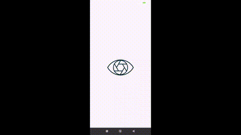

# VisionAid: Intelligent Assistance for the Visually Impaired

---

## 🧠 Project Overview

**VisionAid** is a cross-platform mobile application designed to enhance the autonomy of visually impaired individuals. Leveraging computer vision and machine learning, the app offers:

* **Real-time object recognition**
* **Scene understanding**
* **Text extraction and reading**
* **Safety and hazard alerts**
* **Gemini-powered voice command interpretation**

All features are integrated with audio feedback for immediate accessibility and awareness.

---

## 🎥 Project Demo

Watch a brief walkthrough of the VisionAid application in action:

📹 **[Click here to watch demo](./assets/demo.mp4)**

---

## ✅ Features Implemented

| Feature                | Mode      | Dataset Used          | Description                                                                   |
| ---------------------- | --------- | --------------------- | ----------------------------------------------------------------------------- |
| Object Detection       | Real-time | COCO Dataset          | Detects and classifies objects, provides audio feedback and spatial location. |
| Scene Description      | On-click  | Places365             | Predicts overall scene and delivers audio summary.                            |
| Text Recognition (OCR) | On-click  | Tesseract             | Extracts and reads text from images or camera feed.                           |
| Safety Alerts          | Real-time | COCO Dataset          | Identifies potential hazards (cars, traffic lights, etc.) with warnings.      |
| Voice Command Support  | Real-time | Gemini Pro (PaLM API) | Interprets natural language voice commands and maps them to app actions.      |
| API-based Architecture | Modular   | FastAPI               | Backend services for detection, classification, and text extraction.          |

---

## 🧩 Technical Stack

| Component            | Tool/Framework                     |
| -------------------- | ---------------------------------- |
| Backend              | Python, FastAPI                    |
| Object Detection     | YOLOv5 via Ultralytics (Torch Hub) |
| Scene Classification | Custom model using Places365       |
| OCR                  | Tesseract, OpenCV                  |
| Voice Intelligence   | Gemini Pro (PaLM API)              |
| Mobile App           | Flutter (Dart)                     |
| Communication        | HTTP REST API                      |

---

## 🎙️ Gemini-Powered Voice Commands

We integrated **Google Gemini Pro (via PaLM API)** to enable natural voice interaction. Users can speak commands like:

* “What’s around me?” → triggers object detection
* “Read this sign” → triggers OCR text reading
* “Is it safe?” → triggers hazard detection
* “Where am I?” → triggers scene classification

### Voice Command Flow

1. Speech converted to text using Flutter plugin (`speech_to_text`)
2. Transcribed command is sent to the FastAPI endpoint `/interpret-command`
3. Gemini classifies the intent (e.g., `object_detection`)
4. The corresponding feature is activated and response is spoken back to the user

This empowers **hands-free** and **accessible interaction** tailored for the visually impaired.

---

## 📱 Mobile App Integration (Flutter)

* Communicates with backend endpoints:

  * `/detect-objects`
  * `/scene-detection`
  * `/safety-alerts`
  * `/extract-text`
  * `/interpret-command` (Gemini integration)
* Audio feedback via `flutter_tts`
* Voice interaction via `speech_to_text`
* Large buttons, high-contrast UI, and onboarding tutorial

---

## 🛡️ Ethical and Dataset Compliance

* Datasets: [COCO](https://cocodataset.org/#home), [Places365](http://places2.csail.mit.edu/), [Tesseract](https://github.com/tesseract-ocr/tesseract)
* No user data is stored
* All components adhere to open licenses
* Accessibility-first design with focus on user privacy and autonomy

---

## 🏆 Final Notes

This project demonstrates the practical fusion of **machine learning**, **real-time computer vision**, and **Gemini-based voice intelligence** for inclusive design. It reflects a commitment to social impact through engineering.

> Empowering vision, enabling lives.
